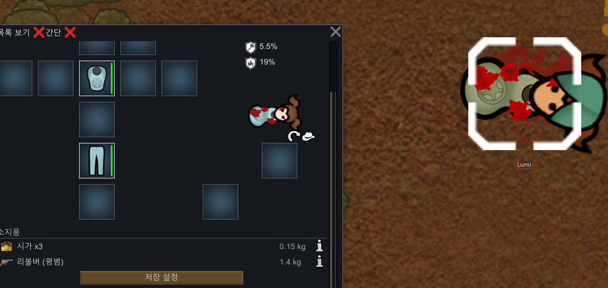

# 1. 개발 동기
RimWorld에서는 폰(Pawn)이 쓰러지거나(Downed) 죽을 때 무기를 떨어트리게 되어있다. 죽는 경우에는 인벤토리의 모든 아이템을 추가적으로 떨어트리게 되어 있다. 매 전투마다 RimWorld에서 쓰러지는 폰이 발생하지 않는 것은 일반적으로 킬존(해외에서는 Killbox라고 불림)을 구축하지 않는 이상 피하기가 힘들다. 일반적으로 림월드 플레이어들 사이에서 킬존을 사용하지 않고 하는 전투는 야전이라고 불리는데, 야전을 치르고나서 쓰러졌던 폰들에게 일일이 무기를 다시 할당해주는 것은 귀찮은 일이다. 특정 폰들마다 사용하는 무기가 다 다르다면 이 또한 문제가 될 수 있다. 이에 아예 무기를 떨어트리지 않는다면 어떨까 하는 아이디어에서 모드를 제작하게 되었다.
    
# 2. 관련모드
## 2.1 Where is my weapon?[1.0-1.3]
---
Where is my weapon?은 tammybee에 의해서 2017년부터 개발된 모드로 폰이 무기를 떨어트렸을때, 다시 무기를 소지할 수 있는 상태가 되면 자신이 소지했던 무기를 찾아서 자동으로 장착하는 모드이다. 좋은 아이디어를 가지고 있는 모드이지만 틱(Tick. RimWorld 내에서의 연산 단위)에 악영향을 많이 끼친다는 유저들의 이야기가 있다. 또한, 모든 경우에서 동작하는 것이 안정적으로 보장되지 않는다는 제보 또한 있다. 더불어서, 무기가 손망실된 경우에는 동작하지 않는다는 문제점이 있다.  

---
## 2.2 SimpleSidearm
---
SimpleSidearm의 주 목적은 한 폰이 두 개 이상의 무기를 들고, 이를 플레이어가 능동적으로 바꿔가며 사용할 수 있도록 하는 것에 있다. 하지만 떨어트린 무기를 기억하고 다시 주우러 가는 기능 또한 가지고 있기엣 서술한다. SimpleSidearm에서 무기를 주으러 가는 방식은 Where is my wepaon?과 유사하다. 만약에 해당 폰이 사용하던 무기가 없어졌을 경우에는 창고에서 동일한 종류의 무기를 집어들게 되어 있으며, 설정에서 언제나 최고의 품질을 지닌 무기만을 집어들도록 할 수 있다. 하지만 이 경우에도 Where is my weapon?과 동일한 문제점이 있는데, 무기가 유실되는 경우가 발생한다는 것이다.

---
## 2.3 Non uno Pinata (don't drop items)
---
림월드 버전 1.3에서 사용할 수 있는 대표적인 모드로 기본적으로 무기나 아이템을 떨어트리지 않는 방식으로 설계되었다. 가장 다양한 기능을 지원하면서도 무기 유실에 대한 문제점을 막을 수 있다는 점이 특징이다. 모드를 개발하면서 이 모드가 존재한다는 것을 알게 되었다. 기본적으로 개발한 모드와 충돌하지 않으며, 약간의 방향성이 다른 부분이 존재한다. 개발한 모드와 가장 유사한 모드이다. 무기나 아이템을 떨어트리지 않기 때문에 무기 유실의 문제에서 자유로우며, 폰들이 자동으로 무기를 장착하는 기능을 가진 모드들과 좋은 궁합을 보인다.

---
# 3. 개발한 모드의 동장방식
개발한 모드의 기본적인 콘셉트, 아이디어는 "무기를 떨어트리지 않는다면 무기를 다시 주울 필요도 없다."이다. 기존의 2.1과 2.2에서 언급한 모드들이 가지고 있었던 약점을 보완하는 형식으로 만들어졌다. 또한 추가로, 일반적으로 쓰러지는 경우와 '조작(Manipulation)' 스탯이 일정 이하로 떨어져 무장해제가 되는(무기를 떨어트리는) 상황 또한 고려하였다.  
개발한 모드는 다음과 같은 동작을 보인다. 먼저, 폰이 무기를 떨어트리는 조건이 만족되면 기본적으로 무기를 폰의 인벤토리로 옮기는 방식으로 무기를 떨어트리는 것을 회피하고, 무기의 재 장착을 편리하게 만든다. 또한 기본적으로 모든 인벤토리 내의 아이템과 장착한 무기등을 떨어트리는 함수의 동작은 HarmonyLib을 이용해서 Prefix로 차단한다. 구체적인 함수는 Verse.Pawn.DropAndForbidEverything이다. 해당 함수는 이름에서 드러나듯이 기본적으로 인벤토리 내의 아이템을 포함해서 모든 아이템을 떨어트리고 정착민들이 해당 아이템에 상호작용하는 것을 금지한다.  
Verse.Pawn_HealthTracker.MakeDowned는 해당 폰을 쓰러진 상태로 만드는 함수이다. 해당 함수에서는 DropAndForbidEverything을 호출해서 모든 아이템을 바닥에 떨어트리는 기능을 구현하고 있다. 위에서 DropAndForbidEverything 함수의 동작을 막았으므로 해당 함수가 호출된 동안에는 어떤 아이템도 떨어트리지 않게 된다. 하지만 일반적으로 MakeDowned가 호출되는 상황이면 아이템을 MakeDowned 호출 후에 떨어트리는 경우가 존재할 수 있기 때문에 Postfix 패치로 함수의 동작 이후에 자동으로 현재 장착하고 있는 주무장을 폰의 인벤토리에 넣도록 하였다.  
Verse.Pawn_HealthTracker.CheckForStateChange 함수에서는 내부적으로 조작 스탯의 변동에 따라서 주무장을 떨어트리는등의 활동을 수행한다. 이에 Prefix 패치로 미리 조작 스탯에 따른 무장을 떨어트릴지 여부를 결정하는 검사를 Prefix 패치내부에서 미리 수행해서 해당 경우에 해당하면 '떨어트릴' 주무장이 없도록 주무장을 폰의 내부 인벤토리로 옮긴다.  

# 4. 실제 동작 테스트  
  
폰이 쓰러졋음에도 주무장인 리볼버가 자동으로 폰의 인벤토리로 옮겨가 떨어트리지 않은 것을 확인할 수 있다.

# 5. 스팀 릴리즈 결과
  
2022-08-27 18:42:43