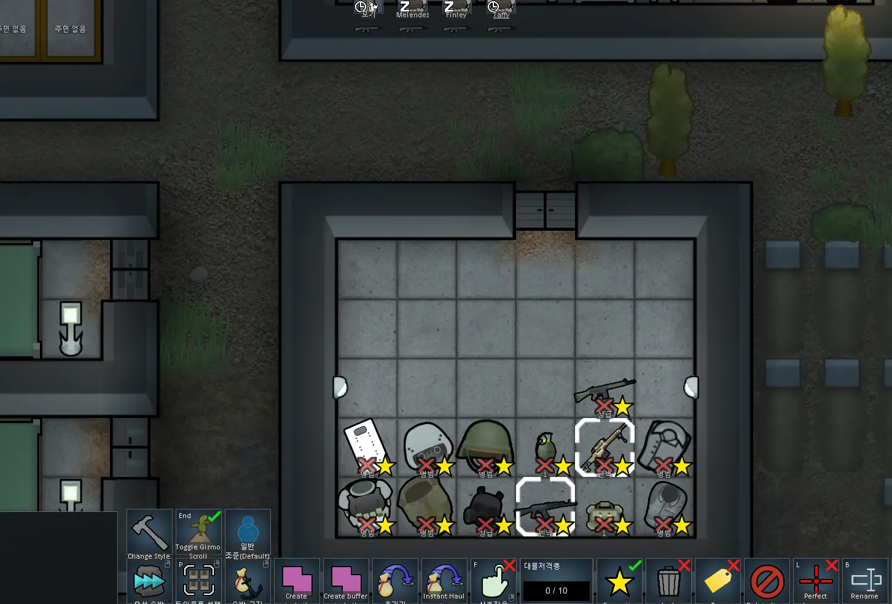
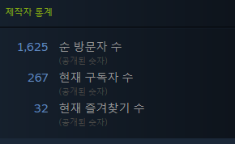

---

---

# 1. 개발 동기

림월드(RimWorld)가 1.3으로 이데올로기(Ideology) DLC와 함께 업데이트하면서, 새롭게 스타일(Style)이라는 것이 생겼다. 스타일은 특정한 아이템의 외관 형식이라고 볼 수 있는데, 동일한 아이템이라도 스타일이 다르면 다른 외관을 가지게 된다. 그러나 스타일을 지정하는 것은 림월드 게임 내부에서 이념(Ideology)로만 지정이 가능해 대부분의 경우 원하는 스타일을 가진 아이템을 가지는 것이 힘들며, 특히 한 아이템을 복수의 스타일로 가지는 것 또한 그러하다. 이에 직접 무기나 의류, 또는 건물등의 스타일을 지정해 줄 수 있는 모드를 만들면 어떠할까 싶어서 모드를 제작하게 되었다.

# 2. 림월드 스타일 시스템

림월드에서 스타일은 CompStyleable로 Comp 기반으로 구현되어 있다. 여기서 Comp 시스템이란 추측컨대, Component의 약자로, 마치 부품과 같이 기본 뼈대에 추가적으로 부착되는 구성요소들을 의미한다.

CompStyleable을 살펴보면 내부에 몇 가지 변수들과 함수 몇개가 존재하는데, 이 중에서 실질적으로 어떤 스타일인지를 결정하는 것은 public ThingStyleDef styleDef이다.  Thing 클래스에서는 해당 객체가 가지고 있는 CompStyleable에 접근해서 styleDef를 가져오기 위한 방법으로 Thing.StyleDef 프로퍼티를 사용한다. StyleDef 프로퍼티는 getter와 settter가 둘 다 존재해 코드 상에서 스타일을 변경하는 것이 간편하게 되어 있다.

구현하고자 하는 시스템은  styleDef 값들을 가져와서 유저가 원하는 styleDef를 선택하도록 한 뒤, 선택한 styleDef를 Thing.StyleDef를 통해서 할당하기만 하면 원하는 기능을 구현할 수 있다.

# 3. 모드 구현

제작하고자 하는 모드는 별도의 HarmonyPatch를 필요로 하지 않는다. 모드의 코드는 다음과 같이 구성된다. 먼저, 스타일이 적용 가능한 모든 ThingDef들을 순환가능한 객체로 가져온다. 이 순환가능한 객체들을 순환하면서 스타일을 선택할 수 있는 창을 띄울 수 있는 버튼을 제공하는 Comp를 ThingDef의 Comp 목록에 삽입한다. 이후 Comp에서(ThingComp를 상속받아야 한다.) CompGetGizmosExtra함수를 오버라이드하고, 여기에 Command_Action Gizmo를 넣어준다. Command_Action Gizmo는 클릭했을 때 Action을 실행한다. Action 부분에는 스타일을 선택할 수 있는 창을 띄우는 코드를 작성한다.

스타일을 선택할 수 있는 창을 띄우는 코드에서는 먼저 StyleCategoryDef를 DefDatabase에서 리스트 형태로 가져온다. 그리고 전체 StyleCategoryDef가 담긴 리스트를 필터를 통해서 원하는 StyleCategoryDef만을 보여주도록 설정한다. 이후 유저가 원하는 스타일의 오른쪽에 있는 Apply 버튼을 누르면 선택된 개체들에 스타일이 적용된다.

# 4. 실제 게임내 동작 화면

     
    [그림 1] 게임내 동작 화면

# 5. 스팀 릴리즈 성과

     
    [그림 2] 스팀 제작자 통계 2022-08-28 18:50:19

