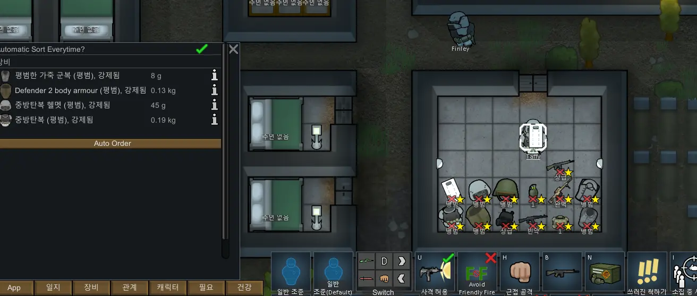

# 1. 개발동기
림월드(RimWorld) 내부적으로도 다양한 의류들이 있고, 외부 추가 모드(mod)로도 많은 의류들이 나와 있다. 그러나 림월드에서는 의류의 착용 범위를 한정하는 시스템으로서 레이어(Layer) 시스템을 사용하고 있다. 그러나 각 레이어가 제공하는 범위가 충분히 넓지 못하기 때문에, 추가적으로 레이어를 늘리는 모드를 받고, 이 모드의 추가 레이어에 의류 레이어를 지정하는 일은 모더(Modder)들에게 귀찮은 작업이다. 또한, 이와는 별개로 각 레이어마다 그려지는 순서(drawOrder)가 지정되어 있는데, 이로 인해서 유저가 생각하는 의류가 나타나는 모습과 실제로 나타나는 모습이 일치하지 않는다. 림월드 내에서는 이 레이어의 그려지는 순서 이외에도 얼굴 앞에만 착용하는 의류인지, 외투 레이어에서 머리까지 가리는 의류인지 등의 또 다른 변수들이 개입해서 최종적으로 화면에 의류를 출력하게 된다. 일반적인 경우, 출력 위치가 겹치는 의류들은 동시에 착용이 불가능하도록 되어있다. 그러나 다른 위치에 착용하면서도 출력 위치가 겹치는 의류들이나 또는 모드로 여러 의류를 동시에 착용할 수 있도록 만들면 의류 간에 그려지는 순서가 유저의 예측과는 별개로 정해지게 되어 원하는 이미지를 얻기가 힘들다. 이 모드는 그런 불편함을 해소하고자 제작되었다.

# 2. 관련모드
## 2.1 Easy Extra Apparel Layers

---
<p align="center">
    </img></br>
    [그림 1] Easy Extra Apparel Layers 프리뷰 이미지    
</p>
<br/>
기본적으로 의류의 착용 위치가 수가 적기 때문에 문제가 발생하는 것을 의류의 착용 위치(레이어) 수를 늘려줌으로써 해결한 모드이다. 그러나 이 모드는 단순히 의류의 레이어 수를 늘려줄 뿐, 기존 의류들의 착용 위치를 수정하지는 않는다. 모드 설명란에 나와 있듯이, 이 모드는 의류를 추가적으로 넣는 모더들을 위한 모드, 기반 모드에 더 가깝다. 다음은 모드 설명란에 모드의 제작자 Ogliss가 이를 언급한 부분이다.
> This is a Modders Resource, NO CONTENT is included in this mod, other than several Apparel layer defs, and a commented out example apparel thingdef.  
  
결국 궁극적으로는 유저들이 추가적인 작업을 할 필요가 없다는 점에서는 긍정적이지만 컨텐츠 제작자들인 모더들이 특별히 이 모드에 나온 레이어들을 활용해야만 하고, 만약에 이 모드에 결함이 발생했는데, 수정되지 않는다면 이 모드를 기반으로 작엉한 모드들의 작동 또한 이상이 생길 수 있다는 점에서 완전한 해결책이라고 보기에는 어렵다.

---
# 3. 선행모드
Harmony와 같은 실질적으로 모든 모드들의 선행 모드는 제외하도록 한다.

---

## 3.1 Oversized Apparel Framework
---

<p align="center">
        </br>
    [그림 2] Oversized Apparel Framework 프리뷰 이미지      
</p>
</br>

이 모드를 선행모드로 선택한 이유를 알기 위해서는 림월드의 그래픽에 대한 기초적인 이해가 필요하다.
림월드는 유니티 3D로 만들어진 게임이지만 실제로 플레이어가 보는 것은 2D 그래픽이다. 그러나 이는 실제로 2차원에 그림을 그려서 표시하는 방식이 아니다. Vector3 구조체를 기준으로 x, y, z 축이 있으며 림월드는 x와 z로 화면 상에서의 위치를 결정하고, y값을 통해서 특정 그래픽들의 '높이'를 결정한다. 이 높이에 따라서 의류들이 그려지고, 표시되는 순서가 결정된다. 의류들이 그려지는 순서도 중요하지만, 이 의류들이 표시되는 '순서'인 y값이 가장 중요한 포인트이다. 본 모드에서는 의류가 표시되는 순서인 y값을 조작하는 것으로 의류의 표시 순서를 바꾼다. 그러나, 본 모드에서 사용할 방식인 모드만의 Draworder를 기준으로 그려지는 순서를 재정렬하고, y값을 조절하는 방식을 사용하기 위해서는 조절된 y값을 의류가 그려지는 과정을 담당하는 함수에 사용하도록 해야 하는데, 이를 위해서는 Transpiler를 사용해야 한다. 이 Transpiler에 대한 패치는 이미 Oversized Apparel Framework에서 처리하고 있다. 따라서 해당 모드를 선행모드로 삼는다. Oversized Apparel Framework에 포함되어 있는 함수인 OversizedApparel.OversizedApparel.GetDrawOffset를 PostfixPatch로 적절한 값을 반환하도록 패치해주고 나면 해당 모드의 기능을 이용해서 의류가 그려지는 순서를 바꿀 수 있다. 해주어야 하는 패치는 아래와 같다.
```C#
    [HarmonyPatch(typeof(OversizedApparel.OversizedApparel), nameof(OversizedApparel.OversizedApparel.GetDrawOffset))]
    public static class GetDrawOffsetFromApparelInstancePatch
    {
        [HarmonyPostfix]
        public static void PostfixPatch(ref Vector3 __result, ApparelGraphicRecord apparelRecord, Rot4 rot)
        {
            __result = apparelRecord.graphic.DrawOffset(rot);
        }
    }
```  
위 패치를 통해서 우리는 각 방향별(동서남북) DrawOffset을 지정해주기만 하면 해당 값에 대한 Drawoffset이 실제 화면에 의류를 그리는데 반영되도록 할 수 있다. Oversized Apparel Framework는 XML 패치를 통해서 의류의 오프셋을 바꾸고, 의류 그래픽을 크게 만들고, 찌그러트리고, 작게 만드는 등의 과정을 수행할 수 있지만 여기서는 동적으로 수행될 수 있도록 하는 것이다.

---
# 4. 모드의 동작 과정
## 4.1. 모드의 핵심 동작 원리
---
제작한 모드에서 의류 순서를 바꾸는 핵심 원리는 위에서 언급했듯이, '높이' 값인 y값에 해당하는 값을 조작하는 것이다. 이는 DrawOffset의 값을 조작하는 것으로 이루어지고, 새롭게 만들어진(하지만 기존의 DrawOrder는 수정하지 않는) Draw Order를 설정함으로써 이루어진다. DrawOffset과 후술할 별도의 의류를 보여주는 탭에서 나타나느 순서 또한 이 별도로 설정된 Draw Order를 통해서 관리된다. 별도로 설정된 Draw Order는 이후 CDO라고 별칭하겠다. 모드는 기본적으로 다음과 같은 방법을 통해서 동작한다. 사용자는 각 폰(Pawn)마다 할당되어 있는 App 탭에서 각 의류별로 위, 아래로 움직임으로써 의류별로 표시되고 그려지는 순서를 변경한다. 그려지는 순서가 변경되면 자동으로 해당 순서에 맞게 CDO를 할당하고, 할당된 CDO에 맞추어서 각 방향마다 {CDO / 10}을 한 값을 DrawOffset의 y값에 대입한다. 기본적으로 의류를 기존의 Draw Order(이하 DO라고 칭함)에 따라서 자동으로 CDO를 결정해주는 옵션이 켜져 있으며, 유저의 필요에 따라서 해당 옵션을 끌 수도 있다. 폰이 생성되면서 착용하게 된 의류들의 CDO 값이 전부 0이면 새롭게 생성된 폰으로 판단하고 CDO 자동정렬을 적용한다.     
<p align="center">
        <br/>
    [그림 3] App 탭을 열었을 때의 이미지. 노랑은 자동정렬 옵션을, 금색은 움직일 수 있는 현재 표시되는 의류들의 순서를, 붉은색은 자동정렬 실행 버튼을, 하늘색은 탭을 닫는 버튼을 표시한다.      
</p>
</br>
<p align="center">
    <br/>
    [그림 4] 모드의 동작 화면
</p>
<br/>

# 5. 스팀 릴리즈 결과
<p align="center">
    <br/>
    [그림 5] 스팀 워크샵 제작자 통계 (2022-08-28)
</p>
<br/>
<p align="center">
    <br/>
    [그림 6] 주간 인기 순위 1페이지
</p>
<br/>
