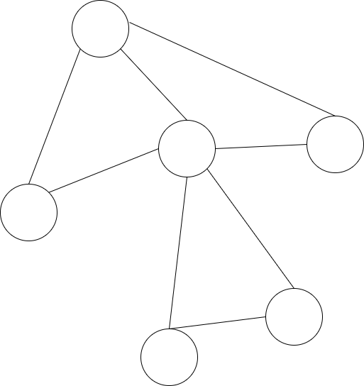
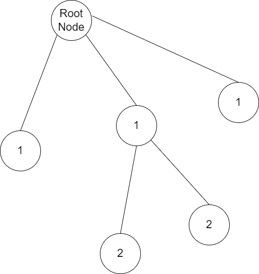

# Breadth-First Search(BFS) 알고리즘

## 1. BFS 알고리즘의 개념

BFS 알고리즘은 그래프 탐색 알고리즘의 일종이다. 그렇다면 그래프란 무엇일까? 아래에 그래프에 대한 정의가 나와있다.

> 그래프는 일련의 꼭짓점들과 그 사이를 잇는 변들로 구성된 조합론적 구조이다.[^1][^2]
>
> *<span style="display:inline-block; width:100%; height:100%; text-align:right;">-한국어 위키백과 그래프 문서 중-</span>*

단순히 말하자면, 그래프는 정점과 간선들로 구성되어 있다고 할 수 있다. 그래프 중에서 순환되는 부분이 존재하지 않느다면 트리 그래프로 볼 수 있다. [그림 1]은 일반적인 그래프와 트리 그래프를 함께 나타낸 것이다.

<span style="display:inline-block; width:50%; text-align:right;"></span> <span style="display:inline-block; width:49%; text-align:left"></span>

<span style="display:inline-block; width:100%; text-align:center">[그림 1] 좌측: 일반적인 그래프, 우측: 트리 그래프</span>

그래프 탐색이란 그래프에서 하나의 정점으로부터 시작하여 차례대로 모든 정점을 한 번씩 방문하는 것이다.[^3] 그래프를 탐색하는 다양한 방법이 있지만, 그 중에서도 너비 우선 탐색이란, 루트 노드(혹은 다른 임의의 노드)에서 시작해서 인접한 노드를 먼저 탐색하는 방법이다. 즉, 시작 정점으로부터 가까운 정점을 먼저 방문하고 멀리 떨어져 있는 정점을 나중에 방문하는 순회 방법이다. 그래프를 깊게 탐색하는 것보다 넓게 탐색하는 것이 특징이며, 두 노드 사이의 최단 경로 혹은 임의의 경로를 찾고 싶을 때 이 방법을 선택한다.[^3] 여기서 깊이란 선택한 루트 노드로부터 얼마나 많은 다른 정점들을 거치느냐를 의미한다. 

<span style="display:inline-block; width:100%; text-align:center"></span>

<span style="display:inline-block; width:100%; text-align:center;">[그림 2] 트리 노드의 루트 노드로부터의 깊이(Depth) 표시</span>

[그림 2]는 트리 그래프애서 Root Node를 정하고 다른 정점들의 Root Node로부터의 깊이를 나타낸 것이다.

## 2. BFS 알고리즘의 특징과 동작과정

BFS 알고리즘은 시작 노드에서 시작해서 거리에 따라 단계별로 탐색한다고 볼 수 있는 알고리즘이다. BFS는 재귀적으로 동작하지 않으며, 구현할 때 어떤 노드를 방문했었는지 여부를 반드시 검사해야 한다. 그렇지 않으면 무한 루프의 위험에 빠질 가능성이 있다.  BFS는 방문한 노드들을 차례로 저장한 후 꺼낼 수 있는 선입선출(FIFO:First In, First Out) 자료구조인 큐(Queue)를 사용한다.[^3]

BFS 알고리즘의 동작과정은 아래 그림과 같다.  시작점을 정한 뒤, 시작점으로부터 최대 깊이가 n인 노드가 있다면 깊이가 1인 모든 노드를 방문한 다음에 깊이가 2인 노드를 방문하는 식으로 깊이가 n인 노드를 모두 방문하는 것으로 알고리즘이 수행된다. 그림과 동작 과정에 대한 해설은 [3]에서 가져왔음을 밝힌다.

<span style="display:inline-block; width:100%; text-align:center;"></span>

<span style="display:inline-block; width:100%; text-align:center;">[그림 3] BFS의 동작과정</span>

[그림 3]의 BFS 동작과정은 아래와 같다.

1. 시작 노드를 방문한다.(방문한 노드 체크)
    1. 큐에 방문된 노드를 삽입(Enqueue)한다.
    2. 초기 상태의 큐에는 시작 노드만이 저장된다.
        1. 즉, 시작 노드와 이웃 노드를 모두 방문한 다음에 이웃의 이웃들을 방문한다.
2. 큐에서 꺼낸 노드와 인접한 노드들을 모두 차례로 방문한다.
    1. 큐에서 꺼낸 노드를 방문한다.
    2. 큐에서 꺼낸 노드와 인접한 노드들을 모두 방문한다.
        1. 인접한 노드가 없다면 큐의 앞에서 노드를 꺼낸다.(Dequeue)
    3. 큐에 방문된 노드를 삽입( Enqueue)한다.
3. 큐가 소진될 때까지 계속한다.

## 3. BFS 알고리즘의 구현

아래 코드는 파이썬으로 2장에 나타난 그래프를 순회탐색한 결과이다.

```python
#-*-coding:utf-8-*-

import sys;
import queue;

class Vertex:
    def __init__(self, vertexId):
        self.vertexId = vertexId;
        self.adjConnectedVertex = list();
        
    @classmethod
    def addEdge(cls, vertexStart, vertexEnd):
        vertexStart.adjConnectedVertex.append(vertexEnd.vertexId);
        vertexEnd.adjConnectedVertex.append(vertexStart.vertexId)
        
def BreadthFirstSearch(vertexList, startingPointIndex):
    que = queue.Queue();
    
    alreadyVisited = list();

    que.put(vertexList[startingPointIndex]);
    alreadyVisited.append(startingPointIndex);

    while (que.empty() == False):
        vertexInQue = que.get();
        print(str(vertexInQue.vertexId) + "->", end="");

        for vertex in vertexInQue.adjConnectedVertex:
            if (alreadyVisited.__contains__(vertex) == False):
                alreadyVisited.append(vertex);
                que.put(vertexList[vertex]);
                

vertexList = [Vertex(0), Vertex(1), Vertex(2), Vertex(3), Vertex(4)];

Vertex.addEdge(vertexList[0], vertexList[1]);
Vertex.addEdge(vertexList[0], vertexList[2]);
Vertex.addEdge(vertexList[0], vertexList[4]);
Vertex.addEdge(vertexList[1], vertexList[2]);
Vertex.addEdge(vertexList[2], vertexList[3]);
Vertex.addEdge(vertexList[3], vertexList[4]);

BreadthFirstSearch(vertexList, 0);
```

```
0->1->2->4->3->
```

11번째 줄에 @classmethod는 다른 언어에서의 static method와 유사하게 사용할 수 있도록 하기 위해서 구현하였다.

16번째 줄부터 33번째 줄까지는 BFS 알고리즘의 직접적인 구현을 다루고 있다. 먼저 방문해야 할 노드들을 담을 큐를 하나 만든다. 그리고 이미 방문한 노드들을저장할 리스트를 하나 만든다. 시작지점의 정점을 큐에 삽입하고, 이미 방문한 노드 리스트에 삽입한다. 이후 큐가 완전히 빌 때까지 큐에서 (방문한) 정점을 꺼내고, 해당 정점과 인접한 다른 정점들 중에서 아직 방문하지 않은 정점을 찾아서 큐(방문할 정점들)에 넣는다. 이후 해당 정점을 방문하고, 다시 방문하지 않은 정점을 찾는 과정을 반복한다.

------

## 참고문헌(Reference)

[^1]: "Graph", Encyclopedia of Mathematics, (English), Springer-Verlag, 2001, ISBN 978-1-55608-010-4
[^2]: "Graph isomorphism", Encyclopedia of mathematics (English), Springer-Verlag, 2001, ISBN 978-1-55608-010-4
[^3]: heejeong Kwon, "[아록리즘] 너비 우선 탐색(BFS)이란", Heee's Development Blog, 2018-08-15, Accessed on: 2022-09-09 20:57:30

